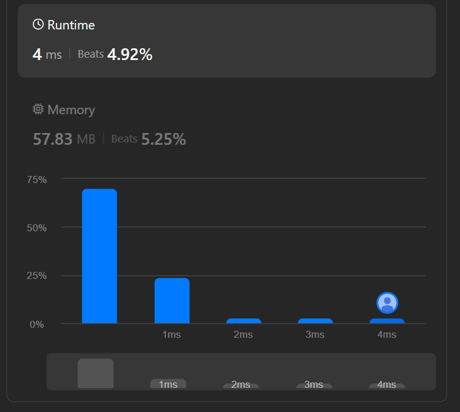

## Image rotation (90 deg)

Looking at the first solution (from /image_rotation.js)

| Question                                | Answer |
| --------------------------------------- | ------ |
| Is the original matrix object modified? | ✅ Yes  |
| Is a new matrix allocated?              | ❌ No   |
| Is it considered an in-place algorithm? | ❌ No   |
| Extra space used?                       | O(N²)  |

Well the solution is weak looking at the statistics :(
