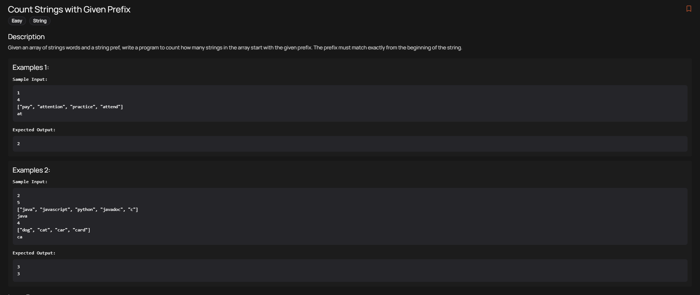
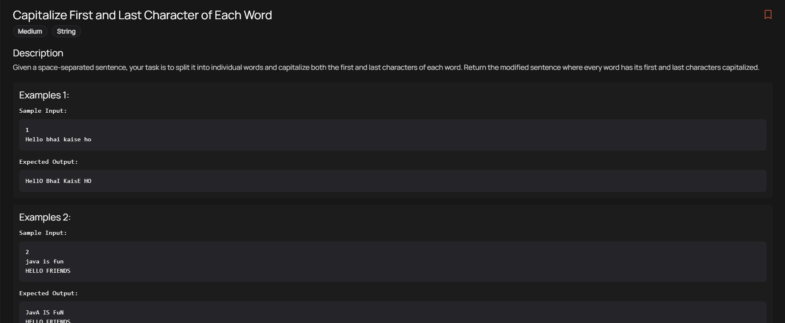
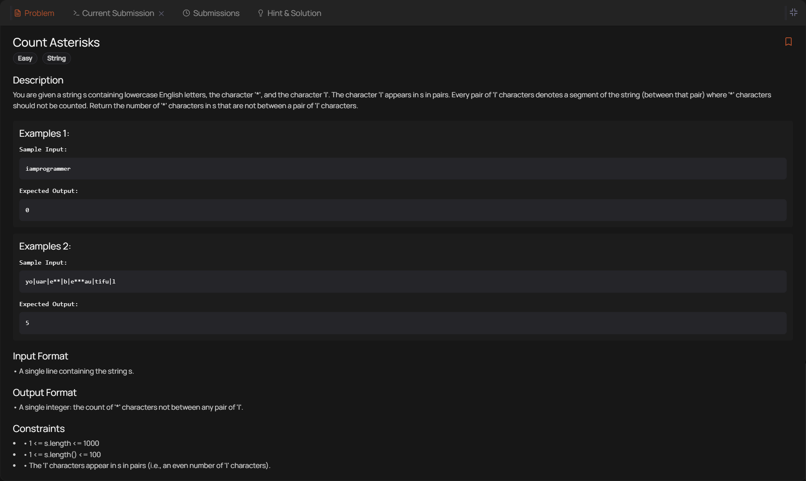
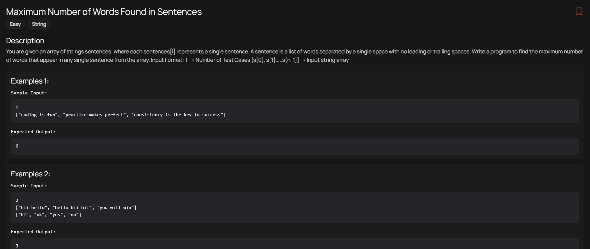
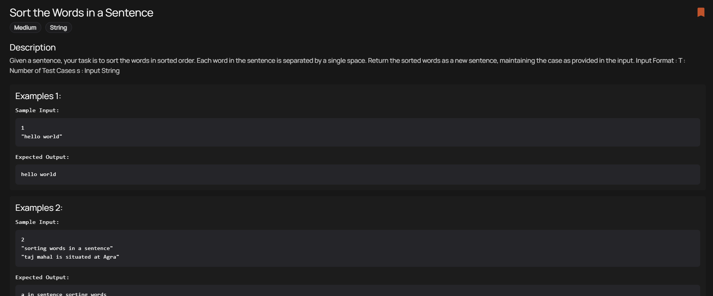

# String problems

## palindromic string problem statement

## toogle alphabet case problem statement

## count prefixes

## capitalize strings

## percentage of the char in string
- it has several approaches for the same time complextiy O(N)
- We could just use simple count variable to track the frequency of the character in the string, but no need of the object/map.
- Using a hash map (letterMap in the code) here introduces unnecessary space complexity, whereas a simple counter variable is both more efficient and cleaner.
- With the current HashMap approach: Even in the worst-case scenario (like if the letter matches a character in a very long string), we are creating an object and storing a key-value pair. This gives it a space complexity of $O(1)$ in terms of unique characters (since it only ever tracks one letter), but it still requires allocating a memory for a heap object, hash collisions tracking (under the hood), and key-string allocation.
- So, a simple counter based would do and cut the slack.

## count asterisks (weird wording and weird expected output breaking the rule in the problem statement when no. of pairs '|' in the string are odd)

- Hopefully, there shouldn't be these type of weird problems god! 🤮🤷‍♀️🤦‍♂️🥲

## Maximum words problem

## sort words problem
